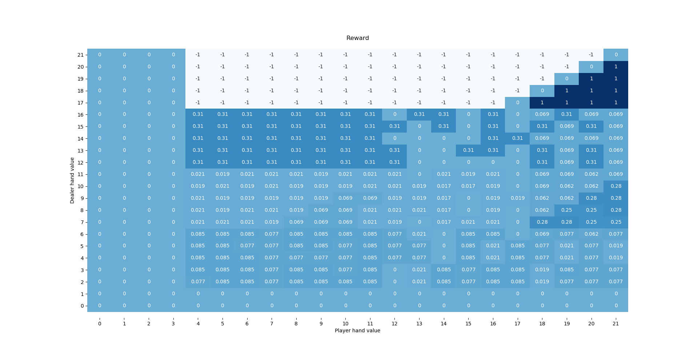

# Introduction to Machine Learning - Lab 07
| Lab7 group 0_             |                     |
| ---                       | ---                 |
| Baldur Þór Haraldsson     | baldurh17@ru.is     |
| Egill Torfason            | egilltor17@ru.is    |
| Hallgrímur Snær Andrésson | hallgrimura17@ru.is |

1. Modeling the environment _(Total points: 50)_ \
   For this task, assume that the game is played with a deck consisting of infinitely many copies of each of the 52 cards. That is, even after having seen a card, the probability of drawing a specific card is still 1/52.
   1. (a) _(20 points)_ \
    How would you describe a state of the problem? What are the possible actions, successor states, rewards and transition probabilities? Try to reduce the state space as much as possible (combine states whose values and best action do not differ), but make sure to keep the Markov property.

        for each state we need to have the hand value of the player and dealer, if either of them have a usable ace, the actions are only from the view of the player which are hit or stand or wait, which is not the same as doing nothing. successor states for the player either involve the dealers turn with addition to dragging more cards or a terminal state. the successor state depends on whether the player or dealer hit or stand, if the player hits he increases his hand gets to do again, same for the dealer, but the both risk busting, going straight to the terminal state. Rewards are 1 if player wins and -1 if dealer wins, 0 if its a draw. The reward is only decided when the game transitions to a terminal state. transitional probabilities are the same as the chance of drawing each card 4/13 for ten and 1/13 for any other card than ten, but multiple states can be reached, so the probability is summed up for every state.

   2. (b) _(30 points)_ \
    Implement your model of the problem by filling out the relevant functions in BlackjackMDP in lab7.py. Test your model by generating some simulations of random game play and checking whether the resulting states make sense. How many reachable states does your model have?

        1132 states.

2. Value Iteration (Total points: 50)
   1. (a) _(25 points)_ \
    Implement Value Iteration for an arbitrary MDP (any object derived from the MDP class in the code). Decide on an appropriate stopping criterion and run your code on the Blackjack MDP.

        ...

   2. (b) _(10 points)_ \
    What is the expected outcome of playing Blackjack with the optimal policy? Who will win the the long run, the player or the dealer? Why?

        The expected outcome of playing blackjack with the optimal policy   is to lose money. The dealer, the player is the first to go, there is a high chance that the player loses right away by hitting where dealer loses automatically, so the player to go first always has the disadvantage, also that the player cant see the other card of the dealer meaning that he'll think the dealer has a good hand while he might not, resulting in the player hitting more. Even though there is a rules that dealer cannot hit when they are above 16. this helps the player since he will automatically win if the dealer has higher than 16 and the player has higher than the dealer, the best action for the dealer is to hit since he'll lose anyway but he wont and the player wins. Given that this rule is in place the dealer has the advantage.
        The higher the starting hand of the dealer the less chance the player has to win

   3. (c) _(15 points)_ \
    Visualize the resulting value function and policy. For example, you could use a table similar to the one on Wikipedia, depending on your choice of state space. 

        
        

   4. (d) _(5 bonus points)_ \
    Suppose the player had an additional action ”Double down”. Upon ”Double down” the player will get exactly one more card and end his turn. He will also double his initial bet, that is, win or loose double the normal amount. Show how having this additional action changes the optimal policy and expected outcome of the game.
        
        ...

   5. (e) _(10 bonus points)_ \
    Playing with an infinite deck of cards is somewhat unrealistic. How does the value of the game change, if we assume to only play with one deck of cards (52 cards)? How many different states do you need to consider in this case?

        We would need 10 additional variables one to keep track of the remainder of each card class (i.e. ace, 2, 3, ... , 9, 10+). giving us an additional 5^9 + 17^1 = 33,203,125 possibilities
        9 *  + 17^1 = 33,203,125
